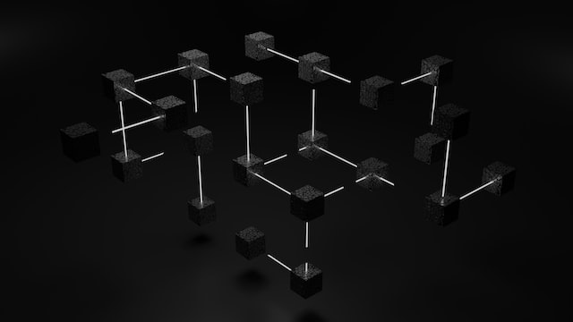

# Crypto Dictionary

## Cryptocurrency 

<figure><figcaption></figcaption></figure>

### Blockchain 

A blockchain is a type of shared database that publicly records every transaction on the network. Each transaction is verified by a number of validators, which is designed to filter out invalid or duplicate transactions. In the context of cryptocurrency, this permanent record of validated transactions is known as a “public ledger.” Different blockchains each use their own methods of validating transactions securely, and the blockchains themselves are generally independent and incompatible with each other.

### Coin 

A coin is a cryptocurrency that operates its own blockchain and is generally used for transaction fees. Examples of popular coins include Bitcoin and Ethereum. This is different from a token, which exists on network for which it is not the native coin

### Token 

A token is an asset that exists on a blockchain for which it is not that network’s native coin. A prime example of a token is RSK, which is a token that runs on the Solana blockchain. The standard for which tokens are built on the Solana blockchain is called ERC-20.

### Wallet 

A crypto wallet is a software that allows a user access to their funds on the blockchain. This can be in the form of a mobile app, desktop web browser extension, or physical device to create and authorize transactions. This is different that leaving funds in a Centralized Exchange, as users with a wallet have full control over their funds.

For example, Phantom is an example of web browser extension wallet that work on the Solana blockchain

#### Seed Phrase/Recovery Phrase 

The seed phrase is a set string of words that acts as the private key to a crypto wallet, similar to a password. However, unlike a password, anyone with the seed phrase will have full access to the wallet, even if they do not know which wallet it is associated with.

<mark style="color:red;">It is recommended</mark> to store your seed phrase in a safe physical location that only you have access to, such as on paper in a safe.

### Centralized Exchange (CEX) 

A centralized exchange is a third-party platform that holds its user’s fiat and crypto holdings, and records transactions on its own ledger (as opposed to the blockchain, or public ledger). Examples of centralized exchanges are Crypto.com or Binance
